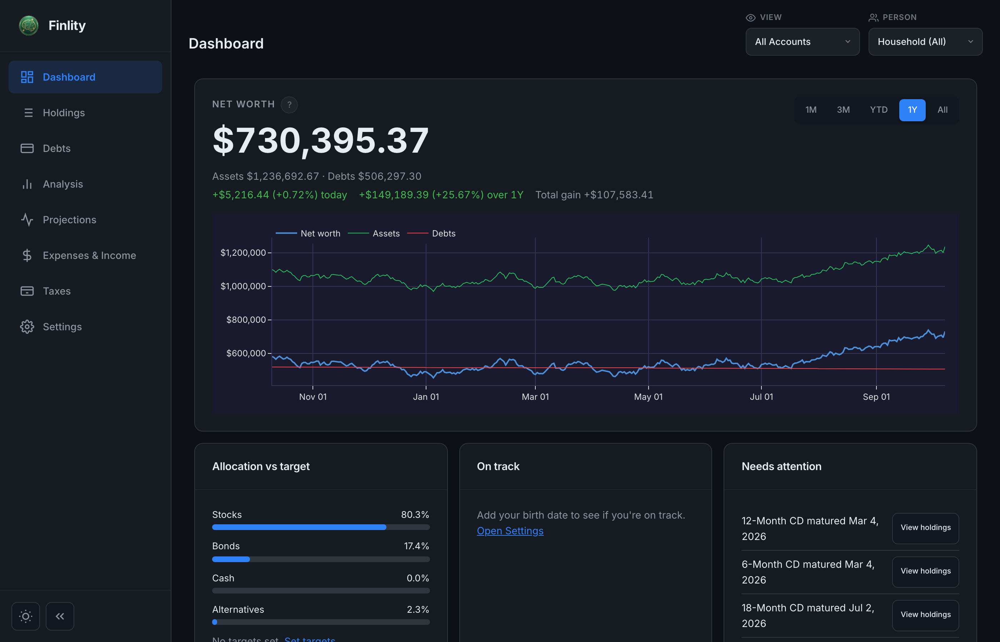
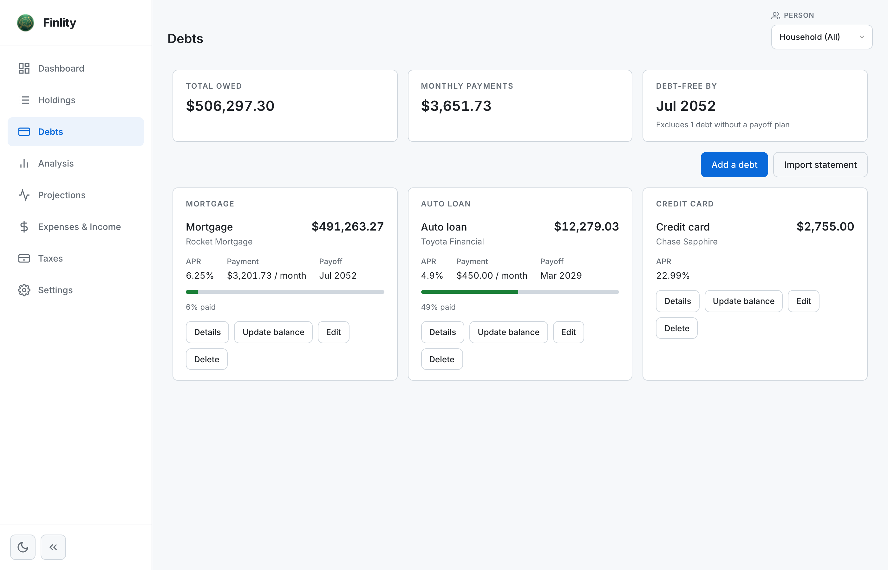
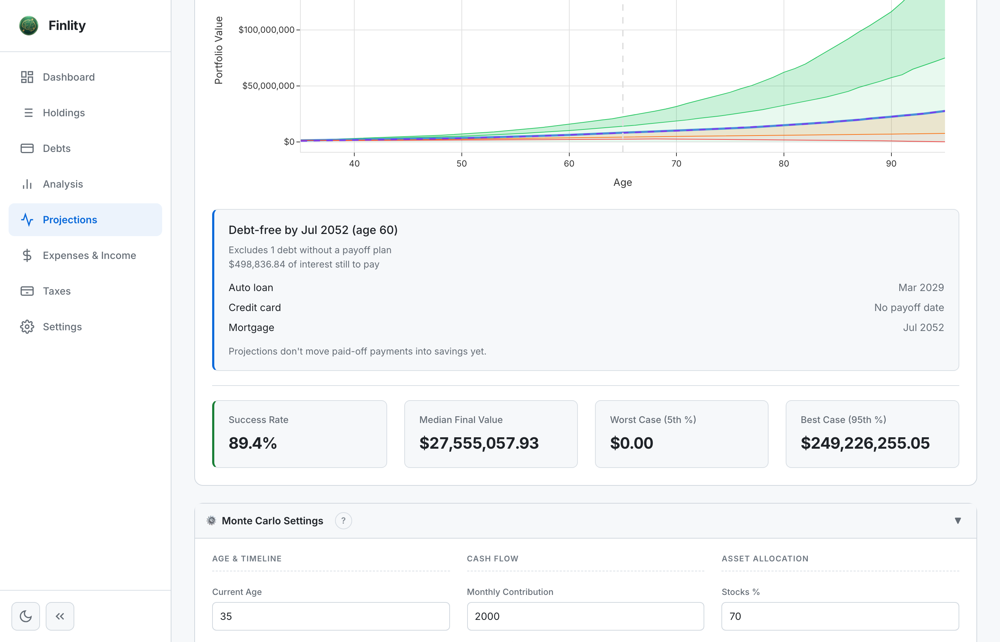

# Finlity

[](https://github.com/tgmerritt/finlity/actions/workflows/test.yml) [](LICENSE)

Finlity is a self-hosted investment portfolio tracker with a FastAPI backend, automated CSV/Excel import, risk-adjusted analytics, allocation triggers, Monte Carlo retirement projections, and an extensible plugin system.

A hosted demo with synthetic data runs at https://app.finlity.net.

| | | |
|---|---|---|
|  |  |  |
| Overview dashboard | Debts and net worth | Monte Carlo projections |

> **Privacy Note**: Your data is stored locally in a SQLite database on the machine running Finlity (self-hosted), or in your browser's own SQLite database on the hosted app at https://app.finlity.net, where the server does not keep your portfolio. Nothing is sent anywhere unless you use a feature that needs the network:
>
> - **Optional AI features** (commentary, advisor chat, fund analysis, smart import categorization and PDF reading) send the relevant text to the provider you configure: Anthropic (Claude), OpenAI, Google Gemini, or Cerebras. They are off until you add an API key.
> - **Price lookups** use yfinance, which sends ticker symbols to Yahoo Finance.
> - **Bank connections** (SimpleFIN Bridge, Akahu) exist only if you set one up in Settings. Your provider credential and your sync requests go through the Finlity server you are using to that provider, and transactions come back for you to review. Nothing is applied without your review.

## Try it

**Hosted demo, nothing to install:** open https://app.finlity.net. It runs on synthetic data and keeps your changes in your browser.

**Run it yourself in about two minutes (Docker):**

```bash
git clone https://github.com/tgmerritt/finlity.git
cd finlity
docker compose up -d
```

Open http://localhost:8000, then turn on **Settings > Demo Mode** to load the bundled demo portfolio. See [Installation](#installation) for the Python route and details.

Requirements: Docker, or Python 3.13 plus Node.js 22 or newer for a local install.

## Features

### Portfolio Management
- **Automated File Import** - Drop CSV/Excel files into folders, auto-detected and imported
- **Drag-and-Drop Upload** - Import files directly in the browser with AI-powered account type detection
- **Multi-Account Support** - Track Roth IRA, Traditional 401(k), 529, HYSA, Treasury Direct, and custom account types
- **Multi-Profile System** - Financial advisors can manage separate databases for multiple clients
- **Cash Position Tracking** - Track uninvested cash with optional APY for interest-bearing accounts
- **CD Support** - Track Certificates of Deposit with APY, maturity dates, and automatic interest accrual
- **Real Estate Tracking** - Track property values including home, rental properties, and land
- **Interest Accrual** - Automatic simple interest calculation for CDs and cash with APY
- **Manual Position Entry** - Add positions directly via dashboard or API
- **Demo Mode** - Toggle between real/demo portfolios instantly without server restart

### Net Worth and Debts
- **Net Worth** - Net worth on the dashboard next to portfolio value, with debts factored into cash flow and projections
- **Debts Page** - Track mortgages, loans, and cards with amortization schedules
- **Debt Wizard** - Guided flow for adding a debt
- **Real Estate to Mortgage** - Convert a real estate row into a linked mortgage, with a confirm screen and undo

### Smart Import and Bank Connections
- **Smart Import Wizard** - Upload bank, card, and loan statements as CSV, OFX/QFX, or text-based PDF. Transactions are categorized (your saved rules first, then optional AI), recurring bills are detected, and everything lands in one review table before anything is written. Any import can be fully undone.
- **Import History and Planned vs Actual** - See past imports and compare budgeted against actual spending
- **Bank Connections** - Link a bank data source once in Settings, then press Sync now. Supports SimpleFIN Bridge and Akahu (you bring your own credential, stored sealed), plus a synthetic demo bank. Each sync opens the same review wizard. On a shared or public deployment such as Heroku they stay off unless the operator sets `CONNECTORS_ENABLED=true` and a rate limiter (see [docs/deployment/heroku.md](docs/deployment/heroku.md)).

### Budget and Cash Flow
- **Budget and Paycheck Tools** - Track income and expenses, and see paycheck breakdowns with tax calculations (federal, state, Social Security)
- **Cash Flow** - Cash flow view that accounts for debt payments

### Dashboard
- **Overview-First Dashboard** - Redesigned overview page with a page toolbar, a first-run empty state, and a bottom tab bar for navigation on phones

### Account Types
- **Retirement**: Traditional 401(k), Roth 401(k), Traditional IRA, Roth IRA, HSA, Pension
- **Non-Retirement**: Taxable Brokerage, 529 College Savings (with beneficiary), High-Yield Savings, Checking, Savings, Treasury Direct
- **Custom**: Create your own account types with user-defined names

### Analysis
- **Risk Metrics** - Sharpe ratio, Sortino ratio, max drawdown, VaR, CVaR, beta vs S&P 500
- **Allocation Analysis** - Sector, geography, style, and cap-size breakdowns matching xlsm format
- **User-Configurable Triggers** - Alert when allocations exceed thresholds
- **Correlation Matrix** - Interactive correlation heatmap for positions (via plugin)
- **Sector Treemap** - Visual sector allocation breakdown (via plugin)
- **Tax-Loss Harvesting** - Identify positions with unrealized losses for tax optimization
- **Dividend Tracking** - Estimate annual dividend income across holdings

### Projections
- **Monte Carlo Simulations** - 10,000 simulations with black swan/golden swan modeling
- **Year-by-Year Withdrawal Tables** - Detailed projections showing balance, withdrawals, and returns
- **FIRE Calculator** - Calculate your Financial Independence number
- **Withdrawal Rate Comparison** - Compare 3%, 4%, 5% withdrawal scenarios
- **Retirement Dashboard Metrics** - Years to retirement, projected balance, monthly income estimates

### Plugin System
- **Importer Plugins** - Add support for new brokerage file formats
- **Analysis Plugins** - Create custom metrics and insights
- **Widget Plugins** - Build custom dashboard visualizations
- **Security & Sandboxing** - Permission-based system protects your data
- **Marketplace** - Install third-party plugins from Git repositories or ZIP files

### Integration
- **AI Providers** - Optional, bring your own key: Anthropic (Claude), OpenAI, Google Gemini, or Cerebras
- **yfinance Integration** - Automatic price fetching and caching
- **Secure API Key Storage** - Encrypted storage in the database or via environment variables

## Installation

Finlity needs **Python 3.13** (the version CI and the Docker image use). A local install also needs **Node.js 22 or newer** to build the frontend.

### Option 1: Docker (Recommended)

```bash
# Clone the repository
git clone https://github.com/tgmerritt/finlity.git
cd finlity

# Build and start (image: portfolio-analyzer, container: portfolio-analyzer)
docker compose up -d --build

# View logs
docker compose logs -f

# Stop
docker compose down
```

Your data lives in `./data` on the host. Optional settings such as API keys go in a `.env` file next to `docker-compose.yml`, for example `ANTHROPIC_API_KEY=your-key-here`.

Open the dashboard at http://localhost:8000, then load demo data with **Settings > Demo Mode**. To start in demo mode, add `PORTFOLIO_DEMO_MODE=true` to `.env` before `docker compose up`.

For development with hot reload: `docker compose --profile dev up portfolio-dev` (container `portfolio-analyzer-dev`, same port).

### Option 2: Local Python

```bash
# Clone the repository
git clone https://github.com/tgmerritt/finlity.git
cd finlity

# Create and activate a virtual environment (Python 3.13)
python3.13 -m venv .venv
source .venv/bin/activate

# Install dependencies and build the frontend
pip install -r requirements.txt
(cd src/web && npm ci && npm run build)

# Create import folders for all account types (optional)
python -m src.main --create-folders

# Start the server in demo mode (opens the dashboard in your browser)
python -m src.main --demo
```

Open the dashboard at http://127.0.0.1:8000. Drop `--demo` to start with your own data, and switch demo data on or off at any time in **Settings > Demo Mode**. You can also run `python scripts/generate_demo.py` to regenerate the demo portfolio.

## Usage

### Starting the Server

```bash
# Default: start server and open browser
python -m src.main

# Specify port and host
python -m src.main --port 8080 --host 0.0.0.0

# Don't open browser automatically
python -m src.main --no-browser

# Enable auto-reload for development
python -m src.main --reload
```

### Importing Positions

1. Create import folders: `python -m src.main --create-folders`
2. Drop CSV/Excel files into the appropriate folder:
   - `data/imports/roth_ira/` - Roth IRA positions
   - `data/imports/traditional_401k/` - 401(k) positions
   - `data/imports/taxable/` - Taxable brokerage
   - `data/imports/529/` - 529 college savings
   - `data/imports/hysa/` - High-yield savings
   - `data/imports/custom_<name>/` - Custom account types

3. Files are automatically imported on server startup

Supported formats:
- CSV files from Schwab, Fidelity, Vanguard (auto-detected)
- Standard CSV with columns: Symbol, Shares, Price
- Excel files (.xlsx, .xls)

### Manual Position Entry

Use the dashboard or API to add positions manually:

```bash
# Create an account
curl -X POST http://localhost:8000/api/portfolio/accounts \
  -H "Content-Type: application/json" \
  -d '{"name": "My Roth IRA", "account_type": "roth_ira", "brokerage": "schwab"}'

# Add a position
curl -X POST http://localhost:8000/api/portfolio/positions \
  -H "Content-Type: application/json" \
  -d '{"account_id": "<account-id>", "ticker": "VTI", "shares": 100, "current_price": 250}'

# Add cash
curl -X POST http://localhost:8000/api/portfolio/positions/cash \
  -H "Content-Type: application/json" \
  -d '{"account_id": "<account-id>", "amount": 5000}'

# Add a CD
curl -X POST http://localhost:8000/api/portfolio/positions/cd \
  -H "Content-Type: application/json" \
  -d '{"account_id": "<account-id>", "amount": 10000, "name": "12-month CD", "interest_rate": 0.05, "maturity_date": "2025-12-01"}'

# Add cash with APY (e.g., high-yield savings)
curl -X POST http://localhost:8000/api/portfolio/positions/cash \
  -H "Content-Type: application/json" \
  -d '{"account_id": "<account-id>", "amount": 5000, "name": "HYSA Cash", "interest_rate": 0.0485}'
```

### Demo Mode

Demo mode allows you to demonstrate the application with fake portfolio data. You can switch between real and demo data **instantly without restarting the server**.

```bash
# Generate demo portfolio data (run once)
python scripts/generate_demo.py

# Or via the dashboard
# Settings → Demo Mode → Generate Demo Data

# Or via API
curl -X POST http://localhost:8000/api/settings/demo/generate
```

**To toggle demo mode:**
- **Dashboard**: Settings → Demo Mode toggle (instant switch)
- **CLI flag**: `python -m src.main --demo`
- **Environment**: `PORTFOLIO_DEMO_MODE=true`

Demo mode creates ~50 realistic positions across 6 account types with real current prices. Your real portfolio is preserved and restored when you disable demo mode.

### Multi-Profile System (Financial Advisors)

Manage multiple client portfolios with separate databases:

```bash
# Create a new profile via API
curl -X POST http://localhost:8000/api/profiles \
  -H "Content-Type: application/json" \
  -d '{"name": "Client A", "description": "Retirement planning client"}'

# Switch active profile
curl -X PUT http://localhost:8000/api/profiles/active \
  -H "Content-Type: application/json" \
  -d '{"profile_id": "client-a"}'

# Or use the dashboard profile switcher in the header
```

Each profile has its own database in `data/databases/{profile_id}/`.

### Database Management

```bash
# Export database to JSON backup
python -m src.main --export-db backup.json

# Import database from backup
python -m src.main --import-db backup.json

# Reset database (delete all data) - requires confirmation
python -m src.main --reset-database

# Check for matured CDs
python -m src.main --check-cds
```

### Allocation Triggers

Create alerts for portfolio conditions:

```bash
# Create a trigger: Alert when AAPL exceeds $50,000
curl -X POST http://localhost:8000/api/analysis/triggers \
  -H "Content-Type: application/json" \
  -d '{"name": "AAPL too high", "condition_type": "ticker_value", "ticker": "AAPL", "operator": ">", "threshold": 50000}'

# Evaluate all triggers
curl http://localhost:8000/api/analysis/triggers/evaluate

# Get only triggered alerts
curl http://localhost:8000/api/analysis/triggers/triggered
```

Condition types:
- `ticker_value` - Position value in dollars
- `ticker_percent` - Position as % of portfolio
- `sector_percent` - Sector as % of portfolio
- `account_invested_percent` - % of account invested (vs cash)
- `total_value` - Total portfolio value
- `account_value` - Value of specific account type

### Withdrawal Projections

```bash
# Generate year-by-year withdrawal table
curl -X POST http://localhost:8000/api/projections/withdrawal-table \
  -H "Content-Type: application/json" \
  -d '{"withdrawal_rate_or_amount": 0.04, "is_percentage": true, "start_age": 65, "end_age": 100}'

# Compare withdrawal rates (3%, 3.5%, 4%, 4.5%, 5%)
curl "http://localhost:8000/api/projections/withdrawal-comparison?start_age=65&end_age=100"
```

## Configuration

### Target Allocations (`config.yaml`)

```yaml
personal:
  dob: "1990-01-01"
  retirement_age: 65

targets:
  asset_class:
    equities: 0.90
    bonds: 0.025
    alternatives: 0.05
    cash: 0.025

  sector:
    technology: 0.41
    healthcare: 0.15
    financials: 0.12
    # ...

monte_carlo:
  num_simulations: 10000
  black_swan_probability: 0.02
  black_swan_impact: -0.40
  golden_swan_probability: 0.02
  golden_swan_impact: 0.27
```

### Fund Compositions (`funds.yaml`)

```yaml
funds:
  VTI:
    name: "Vanguard Total Stock Market ETF"
    morningstar_category: "Large Blend"
    style: "blend"
    market_cap: "large"
    region: "us"
    sector_breakdown:
      Technology: 28.5
      Healthcare: 13.2
      Financials: 12.8
```

### AI Configuration (optional)

For AI-powered fund analysis, portfolio insights, and chat advisor. Anthropic (Claude) is the default provider. OpenAI, Google Gemini, and Cerebras are also supported; their keys are `OPENAI_API_KEY`, `GEMINI_API_KEY`, and `CEREBRAS_API_KEY`, or enter any of them in Settings. The examples below use Anthropic:

```bash
# API Key (required for AI features)
# Option 1: Environment variable
export ANTHROPIC_API_KEY=your-key-here

# Option 2: .env file
echo "ANTHROPIC_API_KEY=your-key-here" >> .env

# Option 3: Store in database via API
curl -X POST http://localhost:8000/api/settings/api-key \
  -H "Content-Type: application/json" \
  -d '{"key": "anthropic_api_key", "value": "your-key-here"}'
```

**Model Selection** (optional - defaults to `sonnet`):

```bash
# Set via environment variable
export ANTHROPIC_MODEL=sonnet

# Or in .env file
ANTHROPIC_MODEL=sonnet
```

Available models:
| Alias | Full Model ID | Best For |
|-------|---------------|----------|
| `opus` | `claude-opus-4-5-20251101` | Complex analysis, highest quality |
| `sonnet` | `claude-sonnet-4-20250514` | Balanced performance/cost (default) |
| `haiku` | `claude-3-5-haiku-20241022` | Fast, simple tasks, lowest cost |

You can use either aliases (`opus`, `sonnet`, `haiku`) or full model IDs.

## API Endpoints

### Portfolio
- `GET /api/portfolio` - Portfolio summary with retirement metrics
- `GET /api/portfolio/accounts` - List all accounts
- `GET /api/portfolio/account-types` - Available account types
- `POST /api/portfolio/accounts` - Create account
- `DELETE /api/portfolio/accounts/{id}` - Delete account
- `GET /api/portfolio/positions` - List all positions
- `POST /api/portfolio/positions` - Add position
- `POST /api/portfolio/positions/cash` - Add cash position (with optional APY)
- `POST /api/portfolio/positions/cd` - Add CD position
- `POST /api/portfolio/positions/real-estate` - Add real estate property
- `DELETE /api/portfolio/positions/{id}` - Delete position
- `GET /api/portfolio/positions/cd/upcoming` - CDs maturing soon
- `POST /api/portfolio/positions/cd/check-maturities` - Convert matured CDs

### Analysis
- `GET /api/analysis/performance` - Performance metrics
- `GET /api/analysis/risk` - Risk metrics
- `GET /api/analysis/allocation` - Basic allocation breakdown
- `GET /api/analysis/allocation/detailed` - Detailed allocation (xlsm format)
- `GET /api/analysis/correlation` - Correlation matrix
- `GET /api/analysis/suggestions` - Rebalancing suggestions
- `GET /api/analysis/triggers` - List triggers
- `POST /api/analysis/triggers` - Create trigger
- `GET /api/analysis/triggers/evaluate` - Evaluate all triggers
- `GET /api/analysis/triggers/triggered` - Get triggered alerts
- `GET /api/analysis/widgets` - Render all widget plugins
- `GET /api/analysis/plugins` - Run all analysis plugins

### Projections
- `POST /api/projections/monte-carlo` - Run Monte Carlo simulation
- `POST /api/projections/fire` - Calculate FIRE metrics
- `POST /api/projections/sensitivity` - Sensitivity analysis
- `POST /api/projections/withdrawal-table` - Year-by-year withdrawals
- `GET /api/projections/withdrawal-comparison` - Compare withdrawal rates

### Imports
- `POST /api/imports/upload` - Drag-drop file upload with AI account detection
- `GET /api/imports/pending` - List pending imports
- `POST /api/imports/process` - Process pending imports
- `GET /api/imports/history` - Import history

### Settings & Demo
- `GET /api/settings/config` - Get configuration
- `PUT /api/settings/config` - Update configuration
- `GET /api/settings/demo-mode` - Get demo mode status
- `PUT /api/settings/demo-mode` - Toggle demo mode (no restart needed)
- `POST /api/settings/demo/generate` - Generate demo data

### Profiles
- `GET /api/profiles` - List all profiles
- `POST /api/profiles` - Create new profile
- `PUT /api/profiles/active` - Switch active profile
- `DELETE /api/profiles/{id}` - Delete profile

### Plugins
- `GET /api/plugins` - List all plugins
- `POST /api/plugins/{id}/enable` - Enable plugin
- `POST /api/plugins/{id}/disable` - Disable plugin
- `POST /api/plugins/install/git` - Install from Git repository
- `DELETE /api/plugins/installed/{id}` - Uninstall plugin

## Project Structure

```
finlity/
├── src/
│   ├── main.py          # FastAPI server & CLI
│   ├── api/             # REST API (portfolio, analysis, projections, imports,
│   │   │                #   smart import, connections, liabilities, budget, ...)
│   │   └── v2/          # Stateless endpoints used by the hosted browser mode
│   ├── analysis/        # Performance, risk, allocation, correlation
│   ├── projections/     # Monte Carlo, FIRE, withdrawal tables
│   ├── liabilities/     # Debts, amortization, net worth
│   ├── smart_import/    # Statement parsers (CSV, OFX/QFX, PDF), categorization, recurring bills
│   ├── connectors/      # Bank connections: SimpleFIN, Akahu, demo provider
│   ├── budget/          # Paycheck, tax, and Social Security calculators
│   ├── importers/       # Folder scanner for CSV/Excel imports
│   ├── database/        # SQLite models, operations, profiles
│   ├── models/          # Position, account, and target types
│   ├── services/        # Secrets, AI providers, demo mode, price refresh, triggers
│   ├── plugins/         # Plugin system and built-in plugins
│   ├── dashboard/       # Chart generation
│   ├── middleware/      # Rate limiting and security headers
│   └── web/             # TypeScript/Vite frontend (src/web/src)
├── scripts/             # Demo data generator and dev helpers
├── tests/               # Backend tests
├── docs/                # Landing page, design docs, deployment and plugin guides
├── data/                # Local data (imports, databases, demo db); mostly git-ignored
├── config.yaml          # Target allocations & settings
├── funds.yaml           # Fund metadata cache
├── Dockerfile
├── docker-compose.yml
└── requirements.txt
```

## Security

- **No stored credentials** - API keys encrypted in database or via environment variables
- **Database reset requires confirmation** - Type "DELETE ALL DATA" to confirm
- **Local SQLite database** - Data is stored locally (or in your browser on the hosted app) and leaves only through the optional features listed in the Privacy Note
- **API keys masked** - Never displayed after entry in the UI
- **Plugin sandboxing** - Third-party plugins run with limited permissions
- **Permission system** - Plugins must declare and receive approval for sensitive operations

**Files excluded from git (see .gitignore):**
- `data/` - Databases, import files, and cache
- `exports/` - CSV exports containing account data
- `.env` - Environment variables and API keys
- `*.db`, `*.sqlite*` - Database files
- `*.csv`, `*.xlsx`, `*.xls` - Spreadsheet files with financial data
- `logs/` - Application logs

## Deployment

Finlity can optionally be deployed to Heroku as a container. See `docs/deployment/heroku.md` for details. Smart import AI stays off on Heroku unless `SMART_IMPORT_AI_ENABLED` and an active rate limiter (`RATE_LIMIT_ENABLED=true` plus a `RATE_LIMIT_SECRET_KEY` of 32+ characters) are set; that page lists the full set.

## Documentation

- [docs/PLUGIN_ARCHITECTURE.md](docs/PLUGIN_ARCHITECTURE.md): how plugins work and how to write one
- [docs/deployment/heroku.md](docs/deployment/heroku.md): deploying to Heroku, plus the public-deployment gates for AI and bank connections
- [docs/design/](docs/design/): design notes for the dashboard redesign, liabilities, smart import, and connections
- [CONTRIBUTING.md](CONTRIBUTING.md): development setup and checks
- [SECURITY.md](SECURITY.md): reporting vulnerabilities
- [CHANGELOG.md](CHANGELOG.md): release history

## Contributing

Contributions are welcome. See [CONTRIBUTING.md](CONTRIBUTING.md) for guidelines and our [CODE_OF_CONDUCT.md](CODE_OF_CONDUCT.md). If you discover a security vulnerability, please report it privately per [SECURITY.md](SECURITY.md) rather than opening a public issue.

## Disclaimer

Finlity is not financial, tax, or investment advice. Projections and calculations (Monte Carlo simulations, tax estimates, and similar outputs) are estimates provided for informational purposes only.

## License

Finlity is released under the [MIT License](LICENSE).
